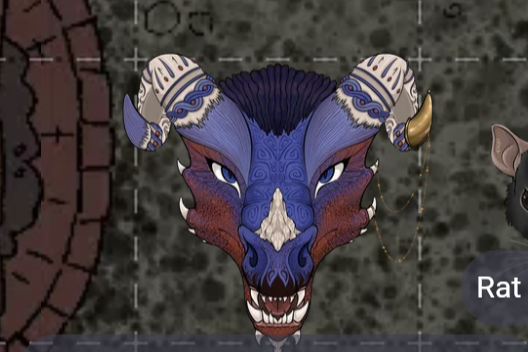

# Test Entry  
  
I am testing out making blog posts with the apple notes app. My intention is to write posts in my notes, export them as markdown, and then converting them to html with python.
  
  
  
Here is an image of my character in the DnD campaign I am doing with some of the other volunteers.
  
This will be cool if I really get this working. Thanks for reading!
